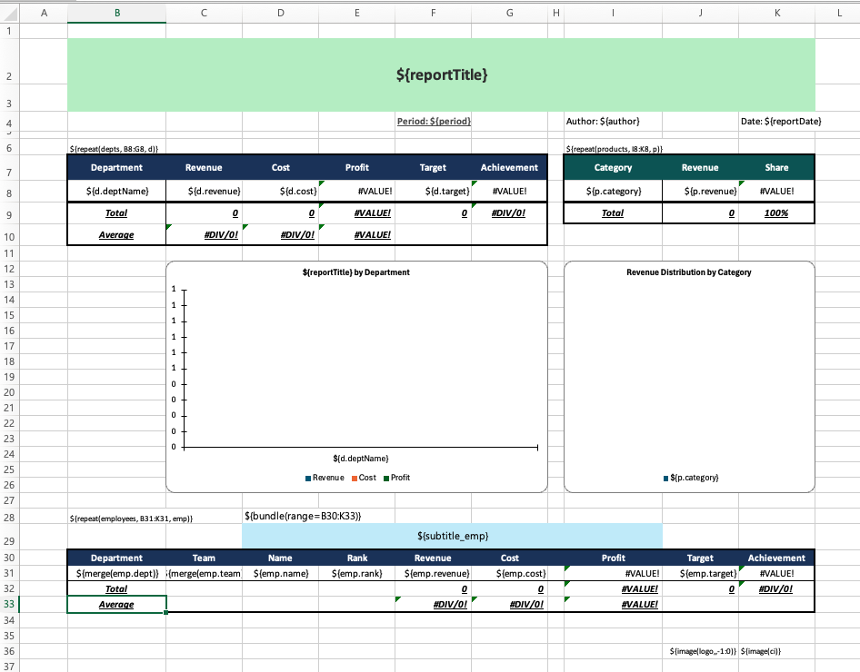

# TBEG (Template Based Excel Generator)

Excel 템플릿에 데이터를 바인딩하여 보고서를 생성하는 라이브러리입니다.

## 주요 기능

- **템플릿 기반 생성**: Excel 템플릿에 데이터를 바인딩하여 보고서 생성
- **반복 데이터 처리**: `${repeat(...)}` 문법으로 리스트 데이터를 행/열로 확장
- **변수 치환**: `${변수명}` 문법으로 셀, 차트, 도형, 머리글/바닥글, 수식 인자 등에 값 바인딩
- **이미지 삽입**: 템플릿 셀에 동적 이미지 삽입
- **자동 셀 병합**: 반복 데이터에서 연속된 같은 값의 셀을 자동 병합
- **요소 묶음**: 여러 요소를 하나의 단위로 묶어 일체로 이동
- **수식 자동 조정**: 데이터 확장 시 SUM, AVERAGE 등 수식 범위를 자동 갱신
- **조건부 서식 복제**: 반복 행에 원본의 조건부 서식을 자동 적용
- **차트 데이터 반영**: 확장된 데이터 범위를 차트에 자동 반영
- **파일 암호화**: 생성된 Excel 파일에 열기 암호 설정
- **문서 메타데이터**: 제목, 작성자, 키워드 등 문서 속성 설정
- **비동기 처리**: 대용량 데이터를 백그라운드에서 처리
- **지연 로딩**: DataProvider를 통한 메모리 효율적 데이터 처리

## 왜 TBEG인가

Apache POI로 직접 Excel을 생성하면 수십 줄의 코드가 필요합니다.

```kotlin
// Apache POI 직접 사용
val workbook = XSSFWorkbook()
val sheet = workbook.createSheet("직원 현황")
val headerRow = sheet.createRow(0)
headerRow.createCell(0).setCellValue("이름")
headerRow.createCell(1).setCellValue("직급")
headerRow.createCell(2).setCellValue("연봉")

employees.forEachIndexed { index, emp ->
    val row = sheet.createRow(index + 1)
    row.createCell(0).setCellValue(emp.name)
    row.createCell(1).setCellValue(emp.position)
    row.createCell(2).setCellValue(emp.salary.toDouble())
}

// 열 폭 조정, 스타일 적용, 수식 추가, 차트... 끝이 없음
```

TBEG을 사용하면 디자이너가 만든 **Excel 템플릿을 그대로 활용**하면서 데이터만 바인딩하면 됩니다.

```kotlin
// TBEG 사용
val data = mapOf(
    "title" to "직원 현황",
    "employees" to employeeList
)

ExcelGenerator().use { generator ->
    val bytes = generator.generate(template, data)
    File("output.xlsx").writeBytes(bytes)
}
```

서식, 차트, 수식, 조건부 서식은 **모두 템플릿에서 관리**합니다. 코드는 데이터 바인딩에만 집중합니다.

> [!TIP]
> **설계 철학**: Excel이 이미 잘하는 기능은 재구현하지 않고 그대로 살립니다.
> 집계는 `=SUM()`으로, 조건부 강조는 조건부 서식으로, 시각화는 차트로 -- 익숙한 Excel 기능을 그대로 활용하세요.
> TBEG은 여기에 동적 데이터 바인딩을 더하고, 데이터가 확장되어도 이 기능들이 의도대로 동작하도록 조정합니다.

## 한 눈에 보기

**템플릿**



**코드**

```kotlin
val data = simpleDataProvider {
    value("reportTitle", "Q1 2026 Sales Performance Report")
    value("period", "Jan 2026 ~ Mar 2026")
    value("author", "Yongho Hwang")
    value("reportDate", LocalDate.now().toString())
    value("subtitle_emp", "Employee Performance Details")
    image("logo", logoBytes)
    image("ci", ciBytes)
    items("depts") { deptList.iterator() }
    items("products") { productList.iterator() }
    items("employees") { employeeList.iterator() }
}

ExcelGenerator().use { generator ->
    generator.generateToFile(template, data, outputDir, "quarterly_report")
}
```

**결과**


변수 치환, 이미지 삽입, 반복 데이터 확장, 자동 셀 병합, 요소 묶음, 수식 범위 조정, 조건부 서식 복제, 차트 데이터 반영까지 TBEG이 자동으로 처리합니다.

> 전체 코드와 템플릿 다운로드는 [종합 예제](./manual/examples/advanced-examples.md#11-종합-예제--분기-매출-실적-보고서)를 참조하세요.

## 이럴 때 TBEG을 사용하세요

| 상황 | 적합 여부 |
|------|----------|
| 정형화된 보고서/명세서 생성 | 적합 |
| 디자이너가 제공한 Excel 양식에 데이터 채우기 | 적합 |
| 복잡한 서식(조건부 서식, 차트, 피벗 테이블)이 필요한 보고서 | 적합 |
| 수만~수십만 행의 대용량 데이터 처리 | 적합 |
| 열 구조가 동적으로 변하는 Excel | 비적합 |
| Excel 파일 읽기/파싱 | 비적합 (TBEG은 생성 전용) |

## 의존성 추가

```kotlin
// build.gradle.kts
dependencies {
    implementation("com.hunet.common:tbeg:1.1.3")
}
```

## 빠른 시작

### Kotlin

```kotlin
import com.hunet.common.tbeg.ExcelGenerator
import java.io.File

data class Employee(val name: String, val position: String, val salary: Int)

fun main() {
    val data = mapOf(
        "title" to "직원 현황",
        "employees" to listOf(
            Employee("황용호", "부장", 8000),
            Employee("한용호", "과장", 6500)
        )
    )

    ExcelGenerator().use { generator ->
        val template = File("template.xlsx").inputStream()
        val bytes = generator.generate(template, data)
        File("output.xlsx").writeBytes(bytes)
    }
}
```

### Spring Boot

```kotlin
@Service
class ReportService(
    private val excelGenerator: ExcelGenerator,
    private val resourceLoader: ResourceLoader
) {
    fun generateReport(): ByteArray {
        val template = resourceLoader.getResource("classpath:templates/report.xlsx")
        val data = mapOf("title" to "보고서", "items" to listOf(...))
        return excelGenerator.generate(template.inputStream, data)
    }
}
```

Spring Boot 환경에서는 `ExcelGenerator`가 자동으로 Bean으로 등록됩니다.

## 템플릿 문법

| 문법 | 설명 | 예시 |
|------|------|------|
| `${변수명}` | 변수 치환 | `${title}` |
| `${item.필드}` | 반복 항목 필드 | `${emp.name}` |
| `${repeat(컬렉션, 범위, 변수)}` | 반복 처리 | `${repeat(items, A2:C2, item)}` |
| `${image(이름)}` | 이미지 삽입 | `${image(logo)}` |
| `${size(컬렉션)}` | 컬렉션 크기 | `${size(items)}` |
| `${merge(item.필드)}` | 자동 셀 병합 | `${merge(emp.dept)}` |
| `${bundle(범위)}` | 요소 묶음 | `${bundle(A5:H12)}` |

상세 문법은 [템플릿 문법 레퍼런스](./manual/reference/template-syntax.md)를 참조하세요.

## 대용량 데이터 처리

내부적으로 Apache POI의 SXSSF를 활용하여 대용량 데이터를 메모리 효율적으로 처리합니다.

### 성능 벤치마크

**테스트 환경**: Java 21, macOS, 3개 컬럼 repeat + SUM 수식

| 데이터 크기   | 비스트리밍  | 스트리밍    | 속도 향상    |
|----------|--------|---------|----------|
| 1,000행   | 179ms  | 146ms   | 1.2배     |
| 10,000행  | 1,887ms | 519ms   | **3.6배** |
| 30,000행  | -      | 1,104ms | -        |
| 50,000행  | -      | 1,269ms | -        |
| 100,000행 | -      | 2,599ms | -        |

> - 비스트리밍 방식은 모든 행을 메모리에 유지한 뒤 일괄 기록하므로, 적은 데이터에서도 GC 부담과 메모리 복사 비용이 발생합니다. 스트리밍 방식은 100행 버퍼만 유지하며 순차 기록하기 때문에 데이터 크기와 무관하게 더 빠릅니다. 
> - 10,000행 이상에서는 메모리 부족이 발생할 수 있어 비스트리밍을 측정하지 않았습니다.

### 타 라이브러리와 비교 (30,000행)

| 라이브러리    | 소요 시간    | 비고                                                          |
|----------|----------|-------------------------------------------------------------|
| **TBEG** | **1.1초** |                                                             |
| JXLS     | 5.2초     | [벤치마크 출처](https://github.com/jxlsteam/jxls/discussions/203) |

> TBEG은 POI API를 직접 호출하고 단일 패스로 스트리밍 기록하는 반면, JXLS는 추상화 계층을 거쳐 템플릿 파싱 -> 변환 -> 기록의 다중 패스를 수행하기 때문에 이 차이가 발생하는 것으로 추정됩니다.

설정 옵션의 상세 내용은 [설정 옵션 레퍼런스](./manual/reference/configuration.md)를 참조하세요.

## 문서

**상세 문서는 [TBEG 매뉴얼](./manual/index.md)을 참조하세요.**

- [사용자 가이드](./manual/user-guide.md)
- [템플릿 문법 레퍼런스](./manual/reference/template-syntax.md)
- [API 레퍼런스](./manual/reference/api-reference.md)
- [설정 옵션 레퍼런스](./manual/reference/configuration.md)
- [기본 예제](./manual/examples/basic-examples.md)
- [고급 예제](./manual/examples/advanced-examples.md)
- [Spring Boot 예제](./manual/examples/spring-boot-examples.md)
- [모범 사례](./manual/best-practices.md)
- [문제 해결](./manual/troubleshooting.md)
- [타 라이브러리 비교](./manual/appendix/library-comparison.md)
- [유지보수 개발자 가이드](./manual/developer-guide.md)

## 샘플 실행

샘플은 `src/test/resources/templates/template.xlsx` 템플릿을 사용합니다.

```bash
# Kotlin 샘플
./gradlew :tbeg:runSample
# 결과: build/samples/

# Java 샘플
./gradlew :tbeg:runJavaSample
# 결과: build/samples-java/

# Spring Boot 샘플
./gradlew :tbeg:runSpringBootSample
# 결과: build/samples-spring/
```
