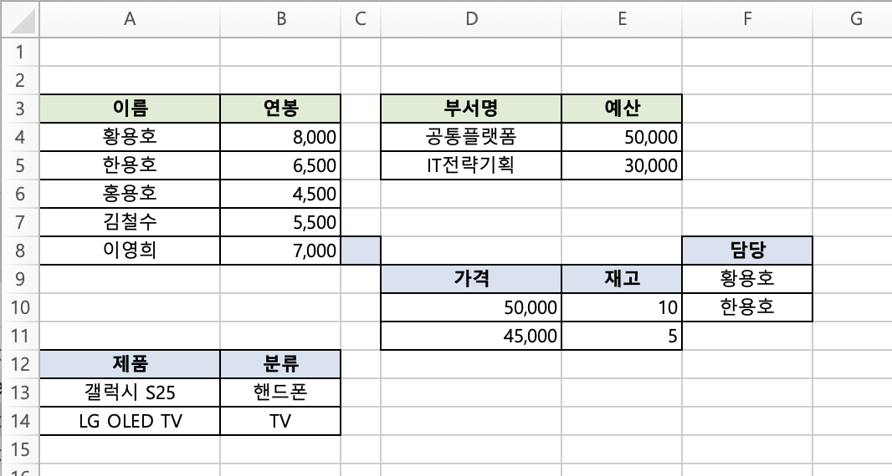
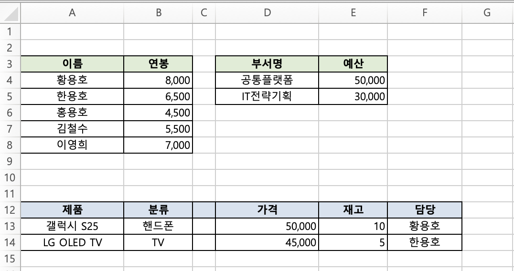

# TBEG 고급 예제 (Java)

## 목차
1. [DataProvider 활용](#1-dataprovider-활용)
   - [1.1 SimpleDataProvider.Builder 사용법](#11-simpledataproviderbuilder-사용법)
   - [1.2 ExcelDataProvider 직접 구현](#12-exceldataprovider-직접-구현)
   - [1.3 JPA/Spring Data 연동](#13-jpaspring-data-연동)
   - [1.4 MyBatis 연동](#14-mybatis-연동)
   - [1.5 외부 API 연동](#15-외부-api-연동)
2. [비동기 처리](#2-비동기-처리)
3. [수식에서 변수 사용](#3-수식에서-변수-사용)
4. [하이퍼링크](#4-하이퍼링크)
5. [다중 시트](#5-다중-시트)
6. [대용량 데이터 처리](#6-대용량-데이터-처리)
7. [다중 반복 영역](#7-다중-반복-영역)
8. [오른쪽 방향 반복](#8-오른쪽-방향-반복)
9. [빈 컬렉션 처리](#9-빈-컬렉션-처리)
10. [다국어 지원 (I18N)](#10-다국어-지원-i18n)
11. [종합 예제](#11-종합-예제)
12. [자동 셀 병합 활용](#12-자동-셀-병합-활용)
13. [요소 묶음 (Bundle)](#13-요소-묶음-bundle)
14. [선택적 필드 노출 활용](#14-선택적-필드-노출-활용)

> [!NOTE]
> 이 문서의 예제는 `resources/templates/` 디렉토리에서 템플릿을 로드합니다.
> 파일 시스템에서 직접 읽으려면 `new FileInputStream("template.xlsx")`을 사용하세요.

---

## 1. DataProvider 활용

DataProvider는 TBEG의 핵심 개념입니다. 대용량 데이터를 효율적으로 처리하기 위해 **지연 로딩**과 **스트리밍** 방식을 지원합니다.

### 데이터 제공 방식 비교

|              방식               |   메모리 사용    | 적합한 상황          |
|:-----------------------------:|:-----------:|:----------------|
|      `Map<String, Any>`       |    전체 로드    | 소량 데이터, 간단한 보고서 |
| `SimpleDataProvider.Builder`  |    지연 로딩    | 중간 규모, 일반적인 사용  |
|    `ExcelDataProvider` 구현     |    완전 제어    | 대용량, DB 직접 연동   |

---

### 1.1 SimpleDataProvider.Builder 사용법

Builder 패턴을 사용한 가장 간편한 방법입니다.

#### 사용할 템플릿 (template.xlsx)

|   | A                                | B               | C             |
|---|----------------------------------|-----------------|---------------|
| 1 | ${title}                         |                 |               |
| 2 | 작성일: ${date}                     | 작성자: ${author}  |               |
| 3 | ${repeat(employees, A5:C5, emp)} |                 |               |
| 4 | 이름                               | 직급              | 연봉            |
| 5 | ${emp.name}                      | ${emp.position} | ${emp.salary} |

- **단일 값**: `${title}`, `${date}`, `${author}` -> DataProvider의 `value()`로 제공
- **반복 영역**: `${repeat(employees, A5:C5, emp)}` -> DataProvider의 `items()`로 제공
- **아이템 속성**: `${emp.name}`, `${emp.position}`, `${emp.salary}` -> 각 아이템의 필드 참조

#### 기본 사용법

```java
import com.hunet.common.tbeg.SimpleDataProvider;
import java.time.LocalDate;
import java.util.List;

// 데이터 클래스 정의
record Employee(String name, String position, int salary) {}

SimpleDataProvider provider = SimpleDataProvider.builder()
    // 단일 값
    .value("title", "직원 현황 보고서")
    .value("date", LocalDate.now())
    .value("author", "황용호")
    // 컬렉션 (List)
    .items("employees", List.of(
        new Employee("황용호", "부장", 8000),
        new Employee("한용호", "과장", 6500)
    ))
    .build();
```

#### 지연 로딩 (Lambda)

데이터가 실제로 필요할 때까지 로드를 지연합니다.

```java
import com.hunet.common.tbeg.ExcelGenerator;
import com.hunet.common.tbeg.SimpleDataProvider;
import java.io.InputStream;
import java.nio.file.Files;
import java.nio.file.Path;
import java.time.LocalDate;
import java.util.Iterator;
import java.util.List;

record Employee(String name, String position, int salary) {}

public class LazyLoadingExample {

    // 직원 수를 조회하는 메서드 (SELECT COUNT(*) 쿼리)
    static int countEmployees() {
        // JPA 사용 시:
        // return (int) employeeRepository.count();
        // return employeeRepository.countByDepartmentId(deptId);

        // 예시용 더미 데이터
        return 3;
    }

    // 직원 목록을 스트리밍으로 조회하는 메서드
    static Iterator<Employee> streamEmployees() {
        // JPA 사용 시:
        // return employeeRepository.findAll().iterator();
        // return employeeRepository.streamAll().iterator();  // 대용량

        // 예시용 더미 데이터
        return List.of(
            new Employee("황용호", "부장", 8000),
            new Employee("한용호", "과장", 6500),
            new Employee("홍용호", "대리", 4500)
        ).iterator();
    }

    public static void main(String[] args) throws Exception {
        // 1. count를 먼저 조회 (가벼운 쿼리)
        int employeeCount = countEmployees();

        // 2. DataProvider 생성 (이 시점에 컬렉션 데이터는 로드되지 않음)
        SimpleDataProvider provider = SimpleDataProvider.builder()
            // 단일 값
            .value("title", "직원 현황 보고서")
            .value("date", LocalDate.now())
            .value("author", "황용호")
            // 컬렉션: count와 함께 지연 로딩 제공
            .items("employees", employeeCount, () -> streamEmployees())
            .build();

        // 3. Excel 생성 (이 시점에 Lambda가 호출되어 데이터 로드)
        try (ExcelGenerator generator = new ExcelGenerator()) {
            InputStream template = LazyLoadingExample.class.getResourceAsStream("/templates/template.xlsx");
            if (template == null) {
                throw new IllegalStateException("템플릿을 찾을 수 없습니다.");
            }

            byte[] result = generator.generate(template, provider);
            Files.write(Path.of("output.xlsx"), result);
        }
    }
}
```

**동작 흐름:**
1. `countEmployees()` 호출 -> count만 먼저 조회 (가벼운 쿼리)
2. `SimpleDataProvider.builder()...build()` 호출 -> Provider 객체 생성 (컬렉션 데이터는 로드 안 함)
3. `generator.generate(template, provider)` 호출
4. 템플릿에서 `employees` 데이터가 필요한 시점에 Lambda 실행, DB 조회
5. 생성된 Excel 바이트 배열을 파일로 저장

**count 제공을 권장하는 이유:**
- TBEG이 미리 전체 행 수를 알 수 있어 수식 범위를 즉시 계산 가능
- 데이터를 2번 순회할 필요 없음
- DB의 `SELECT COUNT(*)` 쿼리는 인덱스만 사용하므로 매우 빠름

> [!NOTE]
> count를 제공하지 않아도 동작에는 문제가 없습니다. 다만 TBEG이 전체 행 수를 파악하기 위해 컬렉션을 먼저 순회해야 하므로, 이중 순회로 인한 성능 저하가 발생할 수 있습니다.

#### 이미지 포함

```java
SimpleDataProvider provider = SimpleDataProvider.builder()
    .value("company", "(주)휴넷")
    // ByteArray로 직접 제공
    .image("logo", LazyLoadingExample.class.getResourceAsStream("/images/logo.png").readAllBytes())
    // URL로 제공 (생성 시점에 자동 다운로드)
    .imageUrl("signature", "https://example.com/signatures/user123.png")
    // 지연 로딩 (이미지가 실제로 필요한 시점에 DB를 조회)
    .imageFromSupplier("stamp", () -> stampRepository.findByUserId(currentUserId).getImageData())
    .build();
```

> `imageFromSupplier()`를 사용하면 이미지가 실제로 필요한 시점에 호출되므로, DB 조회나 외부 API 호출 등 비용이 큰 작업을 지연시킬 수 있습니다.

#### 문서 메타데이터

```java
SimpleDataProvider provider = SimpleDataProvider.builder()
    .value("title", "보고서")
    .metadata(meta -> meta
        .title("2026년 월간 보고서")
        .author("황용호")
        .subject("월간 실적")
        .keywords("월간", "보고서", "실적")
        .company("(주)휴넷"))
    .build();
```

---

### 1.2 ExcelDataProvider 직접 구현

`SimpleDataProvider.Builder`가 대부분의 경우에 충분하지만, 다음과 같은 상황에서는 인터페이스를 직접 구현하는 것이 유리합니다.

#### SimpleDataProvider와 비교

|       관점        | SimpleDataProvider  |         직접 구현          |
|:---------------:|:-------------------:|:----------------------:|
|    데이터 간 의존성    |         불가          |     가능 (메서드 간 호출)      |
|    조회 결과 캐싱     |  Lambda 외부 변수로 우회   |     클래스 필드로 자연스럽게      |
|   조건부 데이터 제공    |    Lambda 내부로 제한    |       자유로운 분기 처리       |
| DB 커서 등 리소스 정리  |         불가          |   `Closeable` 구현 가능    |
|     단위 테스트      |      전체 교체 필요       | Repository Mock 주입 용이  |

#### 인터페이스 구조

```java
public interface ExcelDataProvider {
    Object getValue(String name);             // 단일 값
    Iterator<Object> getItems(String name);   // 컬렉션 (Iterator)
    byte[] getImage(String name);             // 이미지 (선택)
    DocumentMetadata getMetadata();           // 메타데이터 (선택)
    Integer getItemCount(String name);        // 아이템 수 (선택, 성능 최적화)
}
```

#### 구현 예제

```java
public class EmployeeReportDataProvider implements ExcelDataProvider, Closeable {

    private final Long departmentId;
    private final LocalDate reportDate;
    private final EmployeeRepository repository;

    // 조회 결과를 클래스 필드에 캐싱하여 중복 DB 호출 방지
    private Integer cachedCount = null;
    private String cachedDepartmentName = null;

    // DB Stream 리소스를 필드로 관리하여 close() 시 정리
    private Stream<Employee> employeeStream = null;

    public EmployeeReportDataProvider(Long departmentId, LocalDate reportDate, EmployeeRepository repository) {
        this.departmentId = departmentId;
        this.reportDate = reportDate;
        this.repository = repository;
    }

    @Override
    public Object getValue(String name) {
        return switch (name) {
            case "title" -> "부서별 직원 현황";
            case "departmentName" -> getOrLoadDepartmentName();
            case "reportDate" -> reportDate.toString();
            case "generatedAt" -> LocalDateTime.now()
                .format(DateTimeFormatter.ofPattern("yyyy-MM-dd HH:mm"));
            // 다른 조회 결과를 조합하여 값 생성
            case "summary" -> getOrLoadDepartmentName() + " 소속 총 " + getOrLoadCount() + "명";
            default -> null;
        };
    }

    @Override
    public Iterator<Object> getItems(String name) {
        return switch (name) {
            case "employees" -> {
                employeeStream = repository.streamByDepartmentId(departmentId);
                yield employeeStream.map(e -> (Object) e).iterator();
            }
            // 조건에 따라 데이터 제공 여부 결정
            case "managers" -> getOrLoadCount() > 50
                ? repository.findManagersByDepartmentId(departmentId)
                    .stream().map(e -> (Object) e).iterator()
                : null;
            default -> null;
        };
    }

    @Override
    public Integer getItemCount(String name) {
        return switch (name) {
            case "employees" -> getOrLoadCount();
            case "managers" -> getOrLoadCount() > 50
                ? repository.countManagersByDepartmentId(departmentId)
                : null;
            default -> null;
        };
    }

    private int getOrLoadCount() {
        if (cachedCount == null) {
            cachedCount = repository.countByDepartmentId(departmentId);
        }
        return cachedCount;
    }

    private String getOrLoadDepartmentName() {
        if (cachedDepartmentName == null) {
            cachedDepartmentName = repository.getDepartmentName(departmentId);
        }
        return cachedDepartmentName;
    }

    @Override
    public void close() {
        if (employeeStream != null) {
            employeeStream.close();
        }
    }
}
```

#### 사용 예제

```java
@Service
@RequiredArgsConstructor
public class ReportService {

    private final EmployeeRepository employeeRepository;
    private final ResourceLoader resourceLoader;

    @Transactional(readOnly = true)
    public byte[] generateDepartmentReport(Long departmentId) throws IOException {
        EmployeeReportDataProvider provider =
            new EmployeeReportDataProvider(departmentId, LocalDate.now(), employeeRepository);
        try {
            InputStream template = resourceLoader.getResource("classpath:templates/department_report.xlsx")
                    .getInputStream();
            return new ExcelGenerator().generate(template, provider);
        } finally {
            provider.close();
        }
    }
}
```

> [!WARNING]
> `@Transactional` 범위 내에서 Stream을 사용해야 합니다. 트랜잭션이 종료되면 DB 연결이 닫혀 Stream도 무효화됩니다.

---

### 1.3 JPA/Spring Data 연동

#### Repository 인터페이스

```java
public interface EmployeeRepository extends JpaRepository<Employee, Long> {

    // count 쿼리 (성능 최적화용)
    int countByDepartmentId(Long departmentId);

    // Stream 반환 (대용량 처리)
    @QueryHints(@QueryHint(name = HINT_FETCH_SIZE, value = "100"))
    Stream<Employee> streamByDepartmentId(Long departmentId);

    // 또는 Slice 기반 페이징
    Slice<Employee> findByDepartmentId(Long departmentId, Pageable pageable);
}
```

#### Stream 기반 DataProvider

```java
@Service
@RequiredArgsConstructor
public class ReportService {

    private final EmployeeRepository employeeRepository;
    private final ExcelGenerator excelGenerator;
    private final ResourceLoader resourceLoader;

    @Transactional(readOnly = true)
    public byte[] generateReport(Long departmentId) throws IOException {
        int count = employeeRepository.countByDepartmentId(departmentId);

        SimpleDataProvider provider = SimpleDataProvider.builder()
            .value("title", "직원 현황")
            .value("date", LocalDate.now())
            .items("employees", count, () ->
                // @Transactional 내에서 Stream 사용
                employeeRepository.streamByDepartmentId(departmentId).iterator()
            )
            .build();

        InputStream template = resourceLoader.getResource("classpath:templates/report.xlsx")
                .getInputStream();
        return excelGenerator.generate(template, provider);
    }
}
```

#### 페이징 기반 Iterator (메모리 효율적)

대용량 데이터를 페이지 단위로 가져오는 Iterator 구현:

```java
public class PagedIterator<T> implements Iterator<T> {

    private final int pageSize;
    private final Function<Pageable, Slice<T>> fetcher;

    private int currentPage = 0;
    private Iterator<T> currentIterator = Collections.emptyIterator();
    private boolean hasMorePages = true;

    public PagedIterator(int pageSize, Function<Pageable, Slice<T>> fetcher) {
        this.pageSize = pageSize;
        this.fetcher = fetcher;
    }

    @Override
    public boolean hasNext() {
        if (currentIterator.hasNext()) return true;
        if (!hasMorePages) return false;

        // 다음 페이지 로드
        Slice<T> slice = fetcher.apply(PageRequest.of(currentPage++, pageSize));
        currentIterator = slice.getContent().iterator();
        hasMorePages = slice.hasNext();

        return currentIterator.hasNext();
    }

    @Override
    public T next() {
        return currentIterator.next();
    }
}
```

사용 예제:

```java
SimpleDataProvider provider = SimpleDataProvider.builder()
    .value("title", "전체 직원 현황")
    .items("employees", employeeCount, () ->
        new PagedIterator<>(1000, pageable ->
            employeeRepository.findByDepartmentId(departmentId, pageable)
        )
    )
    .build();
```

---

### 1.4 MyBatis 연동

#### Mapper 인터페이스

```java
@Mapper
public interface EmployeeMapper {

    int countByDepartmentId(Long departmentId);

    // Cursor 기반 조회 (스트리밍)
    @Options(fetchSize = 100)
    Cursor<Employee> selectByDepartmentIdWithCursor(Long departmentId);
}
```

#### DataProvider 구현

```java
public class MyBatisEmployeeDataProvider implements ExcelDataProvider {

    private final Long departmentId;
    private final EmployeeMapper employeeMapper;

    private Cursor<Employee> cursor = null;

    public MyBatisEmployeeDataProvider(Long departmentId, EmployeeMapper employeeMapper) {
        this.departmentId = departmentId;
        this.employeeMapper = employeeMapper;
    }

    @Override
    public Object getValue(String name) {
        return switch (name) {
            case "title" -> "직원 현황";
            default -> null;
        };
    }

    @Override
    public Iterator<Object> getItems(String name) {
        return switch (name) {
            case "employees" -> {
                cursor = employeeMapper.selectByDepartmentIdWithCursor(departmentId);
                yield StreamSupport.stream(cursor.spliterator(), false)
                    .map(e -> (Object) e).iterator();
            }
            default -> null;
        };
    }

    @Override
    public Integer getItemCount(String name) {
        return switch (name) {
            case "employees" -> employeeMapper.countByDepartmentId(departmentId);
            default -> null;
        };
    }

    public void close() throws IOException {
        if (cursor != null) {
            cursor.close();
        }
    }
}
```

#### Cursor 리소스 정리

MyBatis Cursor는 데이터베이스 연결을 유지하므로 사용 후 반드시 닫아야 합니다.

```java
@Transactional(readOnly = true)
public byte[] generateReport(Long departmentId) throws IOException {
    MyBatisEmployeeDataProvider provider =
        new MyBatisEmployeeDataProvider(departmentId, employeeMapper);

    try {
        InputStream template = resourceLoader.getResource("classpath:templates/report.xlsx")
                .getInputStream();
        return excelGenerator.generate(template, provider);
    } finally {
        provider.close();  // Cursor를 닫지 않으면 DB 연결이 누수됩니다.
    }
}
```

> [!WARNING]
> `@Transactional` 범위 내에서 Cursor를 사용해야 합니다. 트랜잭션이 종료되면 Cursor도 무효화됩니다.

---

### 1.5 외부 API 연동

마이크로서비스 아키텍처에서 다른 서비스의 API를 호출하여 데이터를 **분할**하여 가져온 후 Excel로 변환하는 경우입니다.

#### PageableList 기반 Iterator

휴넷의 `standard-api-response` 라이브러리에서 제공하는 `PageableList` 타입을 활용합니다.

```java
import com.hunet.common.stdapi.response.PageableList;
import java.util.Collections;
import java.util.Iterator;
import java.util.function.BiFunction;

public class PageableListIterator<T> implements Iterator<T> {

    private final int pageSize;
    private final BiFunction<Integer, Integer, PageableList<T>> fetcher;

    private int currentPage = 1;
    private Iterator<T> currentIterator = Collections.emptyIterator();
    private boolean hasMorePages = true;

    public PageableListIterator(int pageSize, BiFunction<Integer, Integer, PageableList<T>> fetcher) {
        this.pageSize = pageSize;
        this.fetcher = fetcher;
    }

    @Override
    public boolean hasNext() {
        if (currentIterator.hasNext()) return true;
        if (!hasMorePages) return false;

        // 다음 페이지 로드 (API 호출)
        PageableList<T> result = fetcher.apply(currentPage++, pageSize);
        currentIterator = result.getItems().getList().iterator();
        hasMorePages = result.getPage().getCurrent() < result.getPage().getTotal();

        return currentIterator.hasNext();
    }

    @Override
    public T next() {
        return currentIterator.next();
    }
}
```

#### 사용 예제

```java
import com.hunet.common.tbeg.ExcelGenerator;
import com.hunet.common.tbeg.SimpleDataProvider;
import com.hunet.common.stdapi.response.PageableList;
import java.io.InputStream;
import java.nio.file.Files;
import java.nio.file.Path;

record EmployeeDto(String name, int salary) {}

public class ApiIntegrationExample {

    // Feign Client 인터페이스 정의
    // @FeignClient(name = "employee-service")
    // public interface EmployeeApiClient {
    //     @GetMapping("/api/employees")
    //     StandardResponse<PageableList<EmployeeDto>> getEmployees(
    //         @RequestParam("page") int page,
    //         @RequestParam("size") int size
    //     );
    // }

    // 다른 마이크로서비스의 API를 호출하여 데이터를 가져옴
    static PageableList<EmployeeDto> fetchEmployeesFromApi(int page, int size) {
        // Feign Client 사용 시:
        // return employeeApiClient.getEmployees(page, size).getPayload();

        // RestTemplate 사용 시:
        // ParameterizedTypeReference<StandardResponse<PageableList<EmployeeDto>>> typeRef =
        //     new ParameterizedTypeReference<>() {};
        // return restTemplate.exchange(
        //     "/api/employees?page=" + page + "&size=" + size,
        //     HttpMethod.GET, null, typeRef
        // ).getBody().getPayload();

        // WebClient 사용 시:
        // return webClient.get()
        //     .uri("/api/employees?page=" + page + "&size=" + size)
        //     .retrieve()
        //     .bodyToMono(new ParameterizedTypeReference<StandardResponse<PageableList<EmployeeDto>>>() {})
        //     .block().getPayload();

        // 예시용 더미 응답
        return PageableList.build(
            List.of(new EmployeeDto("황용호", 8000), new EmployeeDto("한용호", 6500)),
            100L, (long) size, (long) page
        );
    }

    public static void main(String[] args) throws Exception {
        // 먼저 totalItems 조회 (첫 페이지 호출 또는 별도 count API)
        PageableList<EmployeeDto> firstPage = fetchEmployeesFromApi(1, 1);
        int totalCount = (int) firstPage.getItems().getTotal();

        SimpleDataProvider provider = SimpleDataProvider.builder()
            .value("title", "API 데이터 보고서")
            .items("employees", totalCount, () ->
                new PageableListIterator<>(50, (page, size) ->
                    fetchEmployeesFromApi(page, size)
                )
            )
            .build();

        try (ExcelGenerator generator = new ExcelGenerator()) {
            InputStream template = ApiIntegrationExample.class.getResourceAsStream("/templates/template.xlsx");
            if (template == null) {
                throw new IllegalStateException("템플릿을 찾을 수 없습니다.");
            }

            byte[] result = generator.generate(template, provider);
            Files.write(Path.of("api_report.xlsx"), result);
        }
    }
}
```

> [!NOTE]
> `PageableList`와 `StandardResponse`는 `standard-api-response` 라이브러리에서 제공하는 타입입니다. 마이크로서비스 간 표준 API 응답 형식을 사용하는 경우 이 패턴을 활용할 수 있습니다.

---

## 2. 비동기 처리

### 2.1 CompletableFuture

```java
import com.hunet.common.tbeg.ExcelGenerator;
import com.hunet.common.tbeg.SimpleDataProvider;
import java.io.*;
import java.nio.file.Path;
import java.util.*;
import java.util.concurrent.CompletableFuture;

public class AsyncWithFuture {
    public static void main(String[] args) throws Exception {
        SimpleDataProvider provider = SimpleDataProvider.builder()
            .value("title", "월간 매출 보고서")
            .items("data", generateData())
            .build();

        try (ExcelGenerator generator = new ExcelGenerator();
             InputStream template = AsyncWithFuture.class.getResourceAsStream("/templates/template.xlsx")) {

            CompletableFuture<Path> future = generator.generateToFileFuture(
                template,
                provider,
                Path.of("./output"),
                "monthly_sales"
            );

            // 완료 시 콜백
            future.thenAccept(path -> {
                System.out.println("파일 생성됨: " + path);
            });

            // 완료 대기
            Path result = future.get();
        }
    }

    private static List<Map<String, Object>> generateData() {
        List<Map<String, Object>> data = new ArrayList<>();
        for (int i = 1; i <= 1000; i++) {
            data.add(Map.of("id", i, "value", i * 10));
        }
        return data;
    }
}
```

### 2.2 백그라운드 작업 + 리스너

API 서버에서 즉시 응답하고 백그라운드에서 처리합니다.

```java
import com.hunet.common.tbeg.ExcelGenerator;
import com.hunet.common.tbeg.SimpleDataProvider;
import com.hunet.common.tbeg.async.ExcelGenerationListener;
import com.hunet.common.tbeg.async.GenerationResult;
import java.io.InputStream;
import java.nio.file.Path;
import java.util.*;
import java.util.concurrent.CountDownLatch;
import java.util.concurrent.TimeUnit;
import java.util.stream.IntStream;

public class BackgroundJobExample {
    public static void main(String[] args) throws Exception {
        CountDownLatch latch = new CountDownLatch(1);

        List<Map<String, Object>> items = IntStream.rangeClosed(1, 5000)
            .mapToObj(i -> Map.<String, Object>of("id", i))
            .toList();

        SimpleDataProvider provider = SimpleDataProvider.builder()
            .value("title", "백그라운드 보고서")
            .items("data", items)
            .build();

        try (ExcelGenerator generator = new ExcelGenerator()) {
            InputStream template = BackgroundJobExample.class.getResourceAsStream("/templates/template.xlsx");
            if (template == null) {
                throw new IllegalStateException("템플릿을 찾을 수 없습니다.");
            }

            ExcelGenerationListener listener = new ExcelGenerationListener() {
                @Override
                public void onStarted(String jobId) {
                    System.out.println("[시작] Job ID: " + jobId);
                }

                @Override
                public void onCompleted(String jobId, GenerationResult result) {
                    System.out.println("[완료] 파일: " + result.getFilePath());
                    System.out.println("[완료] 처리 행: " + result.getRowsProcessed());
                    System.out.println("[완료] 소요 시간: " + result.getDurationMs() + "ms");
                    latch.countDown();
                }

                @Override
                public void onFailed(String jobId, Exception error) {
                    System.out.println("[실패] " + error.getMessage());
                    latch.countDown();
                }

                @Override
                public void onCancelled(String jobId) {
                    System.out.println("[취소됨]");
                    latch.countDown();
                }
            };

            var job = generator.submitToFile(
                template,
                provider,
                Path.of("./output"),
                "monthly_sales",
                listener
            );

            System.out.println("작업 제출됨: " + job.getJobId());
            System.out.println("(API 서버에서는 여기서 HTTP 202 반환)");

            // 작업 취소 예시
            // job.cancel();

            latch.await(60, TimeUnit.SECONDS);
        }
    }
}
```

---

## 3. 수식에서 변수 사용

### 템플릿 (formula_template.xlsx)

|   | A      | B                             |
|---|--------|-------------------------------|
| 1 | 시작 행   | ${startRow}                   |
| 2 | 종료 행   | ${endRow}                     |
| 3 |        |                               |
| 4 | 데이터1   | 100                           |
| 5 | 데이터2   | 200                           |
| 6 | 데이터3   | 300                           |
| 7 |        |                               |
| 8 | 합계     | =SUM(B${startRow}:B${endRow}) |

### 코드

```java
import com.hunet.common.tbeg.ExcelGenerator;
import java.io.InputStream;
import java.nio.file.Files;
import java.nio.file.Path;
import java.util.Map;

public class FormulaExample {
    public static void main(String[] args) throws Exception {
        Map<String, Object> data = Map.of(
            "startRow", 4,
            "endRow", 6
        );

        try (ExcelGenerator generator = new ExcelGenerator()) {
            InputStream template = FormulaExample.class.getResourceAsStream("/templates/formula_template.xlsx");
            if (template == null) {
                throw new IllegalStateException("템플릿을 찾을 수 없습니다.");
            }

            byte[] bytes = generator.generate(template, data);
            Files.write(Path.of("formula_output.xlsx"), bytes);
        }
    }
}
```

### 결과

|   | A      | B                  |
|---|--------|--------------------|
| 8 | 합계     | =SUM(B4:B6) -> 600 |

---

## 4. 하이퍼링크

### 템플릿 (link_template.xlsx)

셀 A1에 HYPERLINK 수식 설정:
```
=HYPERLINK("${url}", "${text}")
```

### 코드

```java
import com.hunet.common.tbeg.ExcelGenerator;
import java.io.InputStream;
import java.nio.file.Files;
import java.nio.file.Path;
import java.util.Map;

public class HyperlinkExample {
    public static void main(String[] args) throws Exception {
        Map<String, Object> data = Map.of(
            "text", "휴넷 홈페이지 바로가기",
            "url", "https://www.hunet.co.kr"
        );

        try (ExcelGenerator generator = new ExcelGenerator()) {
            InputStream template = HyperlinkExample.class.getResourceAsStream("/templates/link_template.xlsx");
            if (template == null) {
                throw new IllegalStateException("템플릿을 찾을 수 없습니다.");
            }

            byte[] bytes = generator.generate(template, data);
            Files.write(Path.of("link_output.xlsx"), bytes);
        }
    }
}
```

---

## 5. 다중 시트

### 템플릿 (multi_sheet_template.xlsx)

**Summary 시트**:

|   | A      | B                  |
|---|--------|--------------------|
| 1 | 제목     | ${title}           |
| 2 | 총 직원 수 | ${size(employees)} |

**Employees 시트**:

|   | A                                  | B               | C             |
|---|------------------------------------|-----------------|---------------|
| 1 | ${repeat(employees, A3:C3, emp)}   |                 |               |
| 2 | 이름                                 | 직급              | 연봉            |
| 3 | ${emp.name}                        | ${emp.position} | ${emp.salary} |

### 코드

```java
import com.hunet.common.tbeg.ExcelGenerator;
import java.io.InputStream;
import java.nio.file.Files;
import java.nio.file.Path;
import java.util.List;
import java.util.Map;

record Employee(String name, String position, int salary) {}

public class MultiSheetExample {
    public static void main(String[] args) throws Exception {
        List<Employee> employees = List.of(
            new Employee("황용호", "부장", 8000),
            new Employee("한용호", "과장", 6500),
            new Employee("홍용호", "대리", 4500)
        );

        Map<String, Object> data = Map.of(
            "title", "직원 현황",
            "employees", employees
        );

        try (ExcelGenerator generator = new ExcelGenerator()) {
            InputStream template = MultiSheetExample.class.getResourceAsStream("/templates/multi_sheet_template.xlsx");
            if (template == null) {
                throw new IllegalStateException("템플릿을 찾을 수 없습니다.");
            }

            byte[] bytes = generator.generate(template, data);
            Files.write(Path.of("multi_sheet_output.xlsx"), bytes);
        }
    }
}
```

---

## 6. 대용량 데이터 처리

```java
import com.hunet.common.tbeg.ExcelGenerator;
import com.hunet.common.tbeg.TbegConfig;
import com.hunet.common.tbeg.SimpleDataProvider;
import java.io.InputStream;
import java.nio.file.Path;
import java.util.Iterator;
import java.util.Map;
import java.util.stream.IntStream;

public class LargeDataExample {
    public static void main(String[] args) throws Exception {
        // 대용량 데이터용 설정
        TbegConfig config = new TbegConfig(1000);  // 1000행마다 진행률 보고

        // 데이터 개수 (DB COUNT 쿼리로 조회)
        int dataCount = 1_000_000;

        // 지연 로딩으로 데이터 제공
        SimpleDataProvider provider = SimpleDataProvider.builder()
            .value("title", "연간 거래 내역")
            // count와 함께 지연 로딩 제공 (최적 성능)
            .items("data", dataCount, () ->
                // 100만 건 데이터 시뮬레이션
                IntStream.rangeClosed(1, dataCount)
                    .mapToObj(i -> (Object) Map.of("id", i, "value", i * 10))
                    .iterator()
            )
            .build();

        try (ExcelGenerator generator = new ExcelGenerator(config)) {
            InputStream template = LargeDataExample.class.getResourceAsStream("/templates/template.xlsx");
            if (template == null) {
                throw new IllegalStateException("템플릿을 찾을 수 없습니다.");
            }

            Path path = generator.generateToFile(
                template,
                provider,
                Path.of("./output"),
                "large_report"
            );

            System.out.println("파일 생성됨: " + path);
        }
    }
}
```

---

## 7. 다중 반복 영역

한 시트에 여러 개의 반복 영역을 사용할 수 있습니다.

### 템플릿 (multi_repeat.xlsx)

|   | A                                | B             | C | D                                   | E              |
|---|----------------------------------|---------------|---|-------------------------------------|----------------|
| 1 | ${repeat(employees, A3:B3, emp)} |               |   | ${repeat(departments, D3:E3, dept)} |                |
| 2 | 이름                               | 연봉            |   | 부서명                                 | 예산             |
| 3 | ${emp.name}                      | ${emp.salary} |   | ${dept.name}                        | ${dept.budget} |

### 코드 (Map 방식)

```java
import com.hunet.common.tbeg.ExcelGenerator;
import java.io.InputStream;
import java.nio.file.Files;
import java.nio.file.Path;
import java.util.List;
import java.util.Map;

record Employee(String name, int salary) {}
record Department(String name, int budget) {}

public class MultiRepeatExample {
    public static void main(String[] args) throws Exception {
        Map<String, Object> data = Map.of(
            "employees", List.of(
                new Employee("황용호", 8000),
                new Employee("한용호", 6500),
                new Employee("홍용호", 4500)
            ),
            "departments", List.of(
                new Department("공통플랫폼팀", 50000),
                new Department("IT전략기획팀", 30000)
            )
        );

        try (ExcelGenerator generator = new ExcelGenerator()) {
            InputStream template = MultiRepeatExample.class.getResourceAsStream("/templates/multi_repeat.xlsx");
            if (template == null) {
                throw new IllegalStateException("템플릿을 찾을 수 없습니다.");
            }

            byte[] bytes = generator.generate(template, data);
            Files.write(Path.of("output.xlsx"), bytes);
        }
    }
}
```

### 코드 (SimpleDataProvider.Builder - 지연 로딩)

```java
import com.hunet.common.tbeg.ExcelGenerator;
import com.hunet.common.tbeg.SimpleDataProvider;
import java.io.InputStream;
import java.nio.file.Files;
import java.nio.file.Path;
import java.util.List;

record Employee(String name, int salary) {}
record Department(String name, int budget) {}

public class MultiRepeatLazyExample {
    public static void main(String[] args) throws Exception {
        // 각 컬렉션의 count 조회
        int employeeCount = 3;   // employeeRepository.count()
        int departmentCount = 2; // departmentRepository.count()

        SimpleDataProvider provider = SimpleDataProvider.builder()
            // 첫 번째 컬렉션: 직원
            .items("employees", employeeCount, () ->
                // employeeRepository.findAll().iterator()
                List.<Object>of(
                    new Employee("황용호", 8000),
                    new Employee("한용호", 6500),
                    new Employee("홍용호", 4500)
                ).iterator()
            )
            // 두 번째 컬렉션: 부서
            .items("departments", departmentCount, () ->
                // departmentRepository.findAll().iterator()
                List.<Object>of(
                    new Department("공통플랫폼팀", 50000),
                    new Department("IT전략기획팀", 30000)
                ).iterator()
            )
            .build();

        try (ExcelGenerator generator = new ExcelGenerator()) {
            InputStream template = MultiRepeatLazyExample.class.getResourceAsStream("/templates/multi_repeat.xlsx");
            if (template == null) {
                throw new IllegalStateException("템플릿을 찾을 수 없습니다.");
            }

            byte[] bytes = generator.generate(template, provider);
            Files.write(Path.of("output.xlsx"), bytes);
        }
    }
}
```

### 결과

|   | A    | B     | C | D        | E      |
|---|------|-------|---|----------|--------|
| 1 |      |       |   |          |        |
| 2 | 이름   | 연봉    |   | 부서명      | 예산     |
| 3 | 황용호  | 8,000 |   | 공통플랫폼팀   | 50,000 |
| 4 | 한용호  | 6,500 |   | IT전략기획팀  | 30,000 |
| 5 | 홍용호  | 4,500 |   |          |        |

> [!NOTE]
> 각 repeat 영역은 독립적으로 확장됩니다. 위 예시에서 직원은 3명, 부서는 2개이므로 각각 다른 행 수만큼 확장됩니다.

> [!IMPORTANT]
> 반복 영역은 2D 공간에서 겹치면 안 됩니다.

---

## 8. 오른쪽 방향 반복

### 템플릿 (right_repeat.xlsx)

|   | A                                       | B             |
|---|-----------------------------------------|---------------|
| 1 | ${repeat(months, B1:B2, m, RIGHT)}      | ${m.month}월   |
| 2 |                                         | ${m.sales}    |

### 코드

```java
import com.hunet.common.tbeg.ExcelGenerator;
import java.io.InputStream;
import java.nio.file.Files;
import java.nio.file.Path;
import java.util.List;
import java.util.Map;

record MonthData(int month, int sales) {}

public class RightRepeatExample {
    public static void main(String[] args) throws Exception {
        Map<String, Object> data = Map.of(
            "months", List.of(
                new MonthData(1, 1000),
                new MonthData(2, 1500),
                new MonthData(3, 2000),
                new MonthData(4, 1800)
            )
        );

        try (ExcelGenerator generator = new ExcelGenerator()) {
            InputStream template = RightRepeatExample.class.getResourceAsStream("/templates/right_repeat.xlsx");
            if (template == null) {
                throw new IllegalStateException("템플릿을 찾을 수 없습니다.");
            }

            byte[] bytes = generator.generate(template, data);
            Files.write(Path.of("output.xlsx"), bytes);
        }
    }
}
```

### 결과

|   | A  | B      | C      | D      | E      |
|---|----|--------|--------|--------|--------|
| 1 |    | 1월     | 2월     | 3월     | 4월     |
| 2 |    | 1,000  | 1,500  | 2,000  | 1,800  |

---

## 9. 빈 컬렉션 처리

컬렉션이 비어있을 때 "데이터가 없습니다" 같은 안내 메시지를 표시할 수 있습니다.

### 템플릿 (empty_collection.xlsx)

|   | A                                              | B               | C             |
|---|------------------------------------------------|-----------------|---------------|
| 1 | 직원 현황                                          |                 |               |
| 2 | ${repeat(employees, A4:C4, emp, DOWN, A7:C7)}  |                 |               |
| 3 | 이름                                             | 직급              | 연봉            |
| 4 | ${emp.name}                                    | ${emp.position} | ${emp.salary} |
| 5 |                                                |                 |               |
| 6 |                                                |                 |               |
| 7 | 조회된 직원이 없습니다.                                  |                 |               |

- **A2**: repeat 마커에 `empty` 파라미터로 `A7:C7` 지정
- **A7:C7**: 빈 컬렉션일 때 표시할 내용 (병합 셀 가능)

### 코드

```java
import com.hunet.common.tbeg.ExcelGenerator;
import com.hunet.common.tbeg.SimpleDataProvider;
import java.io.InputStream;
import java.nio.file.Files;
import java.nio.file.Path;
import java.util.Collections;

record Employee(String name, String position, int salary) {}

public class EmptyCollectionExample {
    public static void main(String[] args) throws Exception {
        // 빈 컬렉션
        SimpleDataProvider provider = SimpleDataProvider.builder()
            .items("employees", Collections.<Employee>emptyList())
            .build();

        try (ExcelGenerator generator = new ExcelGenerator()) {
            InputStream template = EmptyCollectionExample.class.getResourceAsStream("/templates/empty_collection.xlsx");
            if (template == null) {
                throw new IllegalStateException("템플릿을 찾을 수 없습니다.");
            }

            byte[] bytes = generator.generate(template, provider);
            Files.write(Path.of("output.xlsx"), bytes);
        }
    }
}
```

### 결과 (데이터가 있는 경우)

|   | A    | B    | C     |
|---|------|------|-------|
| 1 | 직원 현황 |      |       |
| 2 |      |      |       |
| 3 | 이름   | 직급   | 연봉    |
| 4 | 황용호  | 부장   | 8,000 |
| 5 | 한용호  | 과장   | 6,500 |

- 7행의 안내 메시지는 결과에서 제거됨

### 결과 (데이터가 없는 경우)

|   | A              | B    | C    |
|---|----------------|------|------|
| 1 | 직원 현황          |      |      |
| 2 |                |      |      |
| 3 | 이름             | 직급   | 연봉   |
| 4 | 조회된 직원이 없습니다. |      |      |

- 반복 영역에 `empty` 범위의 내용이 표시됨
- `empty` 범위가 단일 셀이면 반복 영역 전체를 병합하여 표시

### 명시적 파라미터 형식

```
${repeat(collection=employees, range=A4:C4, var=emp, direction=DOWN, empty=A7:C7)}
```

### 수식 형식

```
=TBEG_REPEAT(collection=employees, range=A4:C4, var=emp, direction=DOWN, empty=A7:C7)
```

> [!NOTE]
> `empty` 범위는 반복 영역과 다른 위치에 있어야 합니다. 같은 시트의 다른 영역 또는 다른 시트에서 참조할 수 있습니다.

---

## 10. 다국어 지원 (I18N)

TBEG의 변수 치환을 활용하면 별도의 I18N 전용 기능 없이 다국어 보고서를 생성할 수 있습니다.

### 템플릿 (i18n_template.xlsx)

|   | A                                | B               | C             |
|---|----------------------------------|-----------------|---------------|
| 1 | ${label.title}                   |                 |               |
| 2 | ${repeat(employees, A4:C4, emp)} |                 |               |
| 3 | ${label.name}                    | ${label.position} | ${label.salary} |
| 4 | ${emp.name}                      | ${emp.position} | ${emp.salary} |

하나의 템플릿으로 모든 언어를 지원합니다. 고정 텍스트 대신 `${label.*}` 변수를 사용합니다.

### 리소스 번들 준비

**messages_ko.properties**
```properties
report.title=직원 현황 보고서
label.name=이름
label.position=직급
label.salary=연봉
```

**messages_en.properties**
```properties
report.title=Employee Report
label.name=Name
label.position=Position
label.salary=Salary
```

### 코드 (ResourceBundle)

```java
import com.hunet.common.tbeg.ExcelGenerator;
import java.io.InputStream;
import java.nio.file.Files;
import java.nio.file.Path;
import java.util.*;

record Employee(String name, String position, int salary) {}

public class I18nExample {
    public static void main(String[] args) throws Exception {
        Locale locale = Locale.KOREAN;  // 또는 Locale.ENGLISH
        ResourceBundle bundle = ResourceBundle.getBundle("messages", locale);

        Map<String, Object> data = Map.of(
            "label", Map.of(
                "title", bundle.getString("report.title"),
                "name", bundle.getString("label.name"),
                "position", bundle.getString("label.position"),
                "salary", bundle.getString("label.salary")
            ),
            "employees", List.of(
                new Employee("황용호", "부장", 8000),
                new Employee("한용호", "과장", 6500)
            )
        );

        try (ExcelGenerator generator = new ExcelGenerator()) {
            InputStream template = I18nExample.class.getResourceAsStream("/templates/i18n_template.xlsx");
            if (template == null) {
                throw new IllegalStateException("템플릿을 찾을 수 없습니다.");
            }

            byte[] bytes = generator.generate(template, data);
            Files.write(Path.of("report_" + locale.getLanguage() + ".xlsx"), bytes);
        }
    }
}
```

### 코드 (Spring MessageSource)

```java
import com.hunet.common.tbeg.SimpleDataProvider;
import org.springframework.context.MessageSource;
import java.util.*;
import java.util.stream.Collectors;

public class I18nSpringExample {

    public static SimpleDataProvider buildI18nProvider(MessageSource messageSource, Locale locale) {
        // 라벨 변수를 MessageSource에서 일괄 로드
        List<String> keys = List.of("report.title", "label.name", "label.position", "label.salary");
        Map<String, String> labels = keys.stream()
            .collect(Collectors.toMap(
                key -> key.substring(key.indexOf('.') + 1),
                key -> messageSource.getMessage(key, null, locale)
            ));

        return SimpleDataProvider.builder()
            .value("label", labels)
            .items("employees", Collections.emptyList())  // DB 조회 등
            .build();
    }
}
```

### 결과 (한국어)

|   | A         | B    | C     |
|---|-----------|------|-------|
| 1 | 직원 현황 보고서 |      |       |
| 2 |           |      |       |
| 3 | 이름        | 직급   | 연봉    |
| 4 | 황용호       | 부장   | 8,000 |
| 5 | 한용호       | 과장   | 6,500 |

### 결과 (영어)

|   | A               | B        | C      |
|---|-----------------|----------|--------|
| 1 | Employee Report |          |        |
| 2 |                 |          |        |
| 3 | Name            | Position | Salary |
| 4 | 황용호             | 부장       | 8,000  |
| 5 | 한용호             | 과장       | 6,500  |

> [!TIP]
> TBEG은 I18N을 위한 별도 문법을 제공하지 않습니다. Java/Spring의 `ResourceBundle`이나 `MessageSource`로 번역을 처리하고, 그 결과를 변수로 전달하면 됩니다. 하나의 템플릿으로 모든 언어를 지원할 수 있습니다.

---

## 11. 종합 예제

변수 치환, 이미지 삽입, 반복 데이터 확장, 수식 자동 조정, 조건부 서식 자동 적용, 차트 데이터 반영, 자동 셀 병합, 요소 묶음을 하나의 보고서에서 활용하는 예제입니다.

### 템플릿

> [!TIP]
> [템플릿 다운로드 (rich_sample_template.xlsx)](../../src/test/resources/templates/rich_sample_template.xlsx)


템플릿 구성:
- **변수 마커**: `${reportTitle}`, `${period}`, `${author}`, `${reportDate}`, `${subtitle_emp}`
- **이미지 마커**: `${image(logo,,-1:0)}`, `${image(ci)}`
- **반복 마커**: `${repeat(depts, B8:G8, d)}` (부서별 실적), `${repeat(products, I8:K8, p)}` (제품 카테고리), `${repeat(employees, B31:K31, emp)}` (직원별 실적)
- **자동 병합 마커**: `${merge(emp.dept)}` (부서명 병합), `${merge(emp.team)}` (팀명 병합)
- **요소 묶음 마커**: `${bundle(B30:K33)}` (직원 실적 영역을 독립 단위로 보호)
- **수식**: SUM, AVERAGE (합계/평균 행), 셀 간 계산 (Profit = Revenue - Cost, Achievement = Revenue / Target)
- **조건부 서식**: Achievement >= 100% -> 초록, < 100% -> 빨강 / Share >= 30% -> 초록, < 30% -> 빨강
- **차트**: 부서별 Revenue/Cost/Profit 막대 차트, 제품 카테고리 파이 차트

### 코드

```java
import com.hunet.common.tbeg.ExcelGenerator;
import com.hunet.common.tbeg.SimpleDataProvider;
import java.io.File;
import java.io.FileInputStream;
import java.nio.file.Path;
import java.time.LocalDate;
import java.util.List;

record DeptResult(String deptName, long revenue, long cost, long target) {}
record ProductCategory(String category, long revenue) {}
record Employee(String dept, String team, String name, String rank,
                long revenue, long cost, long target) {}

public class ComprehensiveExample {
    public static void main(String[] args) throws Exception {
        SimpleDataProvider data = SimpleDataProvider.builder()
            .value("reportTitle", "Q1 2026 Sales Performance Report")
            .value("period", "Jan 2026 ~ Mar 2026")
            .value("author", "Yongho Hwang")
            .value("reportDate", LocalDate.now().toString())
            .value("subtitle_emp", "Employee Performance Details")
            .image("logo", new File("hunet_logo.png"))
            .image("ci", new File("hunet_ci.png"))
            .items("depts", List.of(
                new DeptResult("Common Platform", 52000, 31000, 50000),
                new DeptResult("IT Strategy",     38000, 22000, 40000),
                new DeptResult("HR Management",   28000, 19000, 30000),
                new DeptResult("Education Biz",   95000, 61000, 90000),
                new DeptResult("Content Dev",     42000, 28000, 45000)
            ))
            .items("products", List.of(
                new ProductCategory("Online Courses", 128000),
                new ProductCategory("Consulting", 67000),
                new ProductCategory("Certification", 45000),
                new ProductCategory("Contents License", 15000)
            ))
            .items("employees", List.of(
                new Employee("Common Platform", "Strategy", "Hwang Yongho", "Manager", 18000, 11000, 17000),
                new Employee("Common Platform", "Strategy", "Park Sungjun",  "Senior",  15000,  9000, 14000),
                new Employee("Common Platform", "Backend",  "Choi Changmin", "Senior",  12000,  7000, 13000),
                new Employee("Common Platform", "Backend",  "Kim Hyunkyung",  "Junior",   7000,  4000,  6000),
                new Employee("IT Strategy",     "Planning", "Byun Jaemyung","Manager", 20000, 12000, 20000),
                new Employee("IT Strategy",     "Planning", "Kim Minchul", "Senior",  11000,  6000, 12000),
                new Employee("IT Strategy",     "Analysis", "Kim Minhee",   "Senior",   7000,  4000,  8000),
                new Employee("Education Biz",   "Sales",    "Yoon Seojin",  "Manager", 35000, 22000, 30000),
                new Employee("Education Biz",   "Sales",    "Kang Minwoo",  "Senior",  28000, 18000, 25000),
                new Employee("Education Biz",   "Sales",    "Lim Soyeon",   "Junior",  15000, 10000, 15000),
                new Employee("Education Biz",   "Support",  "Oh Junhyeok",  "Senior",  17000, 11000, 20000)
            ))
            .build();

        try (ExcelGenerator generator = new ExcelGenerator()) {
            FileInputStream template = new FileInputStream("rich_sample_template.xlsx");
            generator.generateToFile(template, data, Path.of("output"), "quarterly_report");
        }
    }
}
```

### 결과


TBEG이 자동으로 처리한 항목:
- **변수 치환** -- 제목, 기간, 작성자, 날짜, 직원 실적 소제목
- **이미지 삽입** -- 로고, CI
- **반복 데이터 확장** -- 부서 5행, 제품 4행, 직원 11행으로 확장
- **자동 셀 병합** -- 같은 부서명/팀명이 연속된 셀을 자동 병합
- **요소 묶음** -- 직원 실적 영역이 부서 실적 확장에 영향받지 않도록 보호
- **수식 범위 자동 조정** -- `SUM(C8:C8)` -> `SUM(C8:C12)`, `AVERAGE(C8:C8)` -> `AVERAGE(C8:C12)`
- **조건부 서식 자동 적용** -- 달성률/점유율 색상이 모든 행에 적용
- **차트 데이터 범위 반영** -- 차트가 확장된 데이터 범위를 참조

---

## 12. 자동 셀 병합 활용

부서별 매출 보고서에서 같은 부서명을 자동으로 병합하는 예제입니다.

### 템플릿 (dept_merge_template.xlsx)

|   | A                                      | B               | C             | D              |
|---|----------------------------------------|-----------------|---------------|----------------|
| 1 | ${repeat(sales, A3:D3, s)}             |                 |               |                |
| 2 | 부서                                     | 담당자             | 매출액           | 비고             |
| 3 | ${merge(s.dept)}                       | ${s.name}       | ${s.amount}   | ${s.note}      |

- **A3**: `${merge(s.dept)}`는 연속된 같은 부서명 셀을 자동 병합합니다.
- 나머지 열은 일반 필드로, 병합 없이 각 행에 개별 값이 출력됩니다.

### 코드

```java
import com.hunet.common.tbeg.ExcelGenerator;
import java.io.InputStream;
import java.nio.file.Files;
import java.nio.file.Path;
import java.util.List;
import java.util.Map;

record SalesRecord(String dept, String name, int amount, String note) {}

public class AutoMergeExample {
    public static void main(String[] args) throws Exception {
        // 병합 기준(dept)으로 정렬
        Map<String, Object> data = Map.of(
            "sales", List.of(
                new SalesRecord("공통플랫폼팀", "황용호", 12000, ""),
                new SalesRecord("공통플랫폼팀", "한용호", 9500, ""),
                new SalesRecord("공통플랫폼팀", "홍용호", 8000, "신규"),
                new SalesRecord("IT전략기획팀", "김철수", 15000, ""),
                new SalesRecord("IT전략기획팀", "이영희", 11000, "")
            )
        );

        try (ExcelGenerator generator = new ExcelGenerator()) {
            InputStream template = AutoMergeExample.class.getResourceAsStream("/templates/dept_merge_template.xlsx");
            if (template == null) {
                throw new IllegalStateException("템플릿을 찾을 수 없습니다.");
            }

            byte[] bytes = generator.generate(template, data);
            Files.write(Path.of("dept_merge_output.xlsx"), bytes);
        }
    }
}
```

### 결과

<table>
<tr><th></th><th>A</th><th>B</th><th>C</th><th>D</th></tr>
<tr><td>1</td><td></td><td></td><td></td><td></td></tr>
<tr><td>2</td><td>부서</td><td>담당자</td><td>매출액</td><td>비고</td></tr>
<tr><td>3</td><td rowspan="3">공통플랫폼팀</td><td>황용호</td><td>12,000</td><td></td></tr>
<tr><td>4</td><td>한용호</td><td>9,500</td><td></td></tr>
<tr><td>5</td><td>홍용호</td><td>8,000</td><td>신규</td></tr>
<tr><td>6</td><td rowspan="2">IT전략기획팀</td><td>김철수</td><td>15,000</td><td></td></tr>
<tr><td>7</td><td>이영희</td><td>11,000</td><td></td></tr>
</table>

- A3:A5가 "공통플랫폼팀"으로 병합, A6:A7이 "IT전략기획팀"으로 병합됩니다.
- 여러 열에 `merge`를 적용하면 각 열이 독립적으로 병합됩니다.

> [!IMPORTANT]
> `merge` 마커는 연속된 같은 값만 병합합니다. 데이터를 병합 기준 필드로 미리 정렬하세요.

---

## 13. 요소 묶음 (Bundle)

한 시트에 두 개 이상의 repeat 영역이 있으면, repeat 아래에 있는 다른 요소들이 각 repeat의 확장에 의해 제각기 밀려나서 레이아웃이 깨질 수 있습니다. `bundle` 마커로 영역을 묶으면 묶인 영역이 마치 하나의 셀인 것처럼 동시에 움직여 레이아웃을 유지합니다.

### 템플릿 (bundle_template.xlsx)

|    | A                                  | B             | C | D                                     | E              | F    |
|----|------------------------------------|---------------|---|---------------------------------------|----------------|------|
| 2  | ${repeat(employees, A4:B4, emp)}   |               |   | ${repeat(departments, D4:E4, dept)}   |                |      |
| 3  | 이름                                 | 연봉            |   | 부서명                                   | 예산             |      |
| 4  | ${emp.name}                        | ${emp.salary} |   | ${dept.name}                          | ${dept.budget} |      |
|    |                                    |               |   |                                       |                |      |
| 7  | ${bundle(A8:F10)}                  |               |   |                                       |                |      |
| 8  | 제품                                 | 분류            |   | 가격                                    | 재고             | 담당   |
| 9  | (제품 데이터1)                          |               |   |                                       |                |      |
| 10 | (제품 데이터2)                          |               |   |                                       |                |      |

- **행 2~4**: 두 개의 독립적인 repeat 영역 (employees, departments)
- **A7**: `${bundle(A8:F10)}` — bundle 마커는 범위 밖(7행)에 배치하고, 묶을 대상(8~10행)을 범위로 지정합니다.

### 코드

```java
import com.hunet.common.tbeg.ExcelGenerator;
import java.io.InputStream;
import java.nio.file.Files;
import java.nio.file.Path;
import java.util.List;
import java.util.Map;

record Employee(String name, int salary) {}
record Department(String name, int budget) {}

public class BundleExample {
    public static void main(String[] args) throws Exception {
        Map<String, Object> data = Map.of(
            "employees", List.of(
                new Employee("황용호", 8000),
                new Employee("한용호", 6500),
                new Employee("홍용호", 4500),
                new Employee("김철수", 5500),
                new Employee("이영희", 7000)
            ),
            "departments", List.of(
                new Department("공통플랫폼팀", 50000),
                new Department("IT전략기획팀", 30000)
            )
        );

        try (ExcelGenerator generator = new ExcelGenerator()) {
            InputStream template = BundleExample.class.getResourceAsStream("/templates/bundle_template.xlsx");
            if (template == null) {
                throw new IllegalStateException("템플릿을 찾을 수 없습니다.");
            }

            byte[] bytes = generator.generate(template, data);
            Files.write(Path.of("bundle_output.xlsx"), bytes);
        }
    }
}
```

### bundle이 없을 때 vs 있을 때

**bundle이 없을 때**: employees가 4행 확장되면 A-B 열은 4행 밀려나고, departments가 1행 확장되면 D-E 열은 1행 밀려납니다. 하지만 C열, F열은 밀어내는 요소가 없으므로 원래 위치를 유지합니다. 결과적으로 제품 표의 각 열이 제각기 다른 행에 위치하게 되어 레이아웃이 깨집니다.



**bundle이 있을 때**: bundle로 지정된 영역이 하나의 셀처럼 취급되어, 가장 많이 밀리는 만큼(4행) 모든 요소가 함께 이동합니다. 제품 표가 온전한 형태를 유지합니다.



> [!NOTE]
> bundle 범위는 다른 범위형 요소(병합된 셀, repeat 마커, 다른 bundle 마커 등)의 범위와 경계에 걸치면 안 됩니다. bundle 안에 해당 요소의 전체 범위가 포함되어야 합니다.

---

## 14. 선택적 필드 노출 활용

선택적 필드 노출의 고급 시나리오입니다. 기본 사용법은 [기본 예제 - 선택적 필드 노출](./basic-examples.md#8-선택적-필드-노출)을 참조하세요.

### 14.1 DIM 모드 -- 비활성화 스타일 적용

DELETE 모드(기본값)는 열을 물리적으로 제거하지만, DIM 모드는 열을 유지하면서 데이터 영역의 값을 제거하고 비활성화 스타일(회색 배경, 연한 글자색)을 적용합니다. 필드 타이틀 등 repeat 밖 bundle 영역은 글자색만 연한 색으로 변경되며, 값과 배경은 유지됩니다.

#### 템플릿 (hideable_dim_template.xlsx)

|   | A                                  | B               | C                                                          | D                |
|---|------------------------------------|-----------------|------------------------------------------------------------|------------------|
| 1 | ${repeat(employees, A3:D3, emp)}   |                 |                                                            |                  |
| 2 | 이름                                 | 부서              | 급여                                                         | 입사일              |
| 3 | ${emp.name}                        | ${emp.dept}     | ${hideable(value=emp.salary, bundle=C2:C3, mode=dim)}      | ${emp.hireDate}  |

- hideable 마커는 데이터 행(repeat 범위 내)에 배치하고, bundle로 필드 타이틀(C2)까지 포함합니다.
- `mode=dim`을 지정하면 열 구조는 유지하면서 데이터 영역의 값만 비웁니다.

#### 코드

```java
SimpleDataProvider provider = SimpleDataProvider.builder()
    .items("employees", List.of(
        Map.of("name", "김철수", "dept", "개발팀", "salary", 5000, "hireDate", "2020-01-15"),
        Map.of("name", "이영희", "dept", "기획팀", "salary", 4500, "hireDate", "2021-03-20")
    ))
    .hideFields("employees", "salary")
    .build();

try (ExcelGenerator generator = new ExcelGenerator()) {
    FileInputStream template = new FileInputStream("hideable_dim_template.xlsx");
    byte[] bytes = generator.generate(template, provider);
    Files.write(Path.of("output.xlsx"), bytes);
}
```

#### 결과 (급여 컬럼이 비활성화 스타일로 표시됨)

|   | A   | B   | C          | D          |
|---|-----|-----|------------|------------|
| 1 |     |     |            |            |
| 2 | 이름  | 부서  | 급여(흐리게 표시) | 입사일        |
| 3 | 김철수 | 개발팀 | _(비활성화)_   | 2020-01-15 |
| 4 | 이영희 | 기획팀 | _(비활성화)_   | 2021-03-20 |

- C열 데이터 셀에 회색 배경이 적용되고 값은 비어 있습니다. 필드 타이틀(급여)은 글자색만 연한 색으로 변경됩니다.
- 열 구조가 유지되므로 수식 참조가 깨지지 않습니다.

### 14.2 다중 필드 숨기기

여러 필드를 동시에 숨길 수 있습니다.

#### 템플릿

|   | A                                  | B                                    | C               | D                                    | E                |
|---|------------------------------------|------------------------------------- |-----------------|--------------------------------------|--------------------|
| 1 | ${repeat(employees, A3:E3, emp)}   |                                      |                 |                                      |                    |
| 2 | 이름                                 | 부서                                   | 직급              | 급여                                   | 입사일                |
| 3 | ${emp.name}                        | ${hideable(emp.dept, B2:B3)}         | ${emp.rank}     | ${hideable(emp.salary, D2:D3)}       | ${emp.hireDate}    |

#### 코드

```java
SimpleDataProvider provider = SimpleDataProvider.builder()
    .items("employees", List.of(
        Map.of("name", "김철수", "dept", "개발팀", "rank", "과장", "salary", 5000, "hireDate", "2020-01-15"),
        Map.of("name", "이영희", "dept", "기획팀", "rank", "대리", "salary", 4500, "hireDate", "2021-03-20")
    ))
    .hideFields("employees", "dept", "salary")  // 부서와 급여 컬럼 동시 숨김
    .build();

try (ExcelGenerator generator = new ExcelGenerator()) {
    FileInputStream template = new FileInputStream("multi_hide_template.xlsx");
    byte[] bytes = generator.generate(template, provider);
    Files.write(Path.of("output.xlsx"), bytes);
}
```

#### 결과

|   | A    | B    | C          |
|---|------|------|------------|
| 1 |      |      |            |
| 2 | 이름   | 직급   | 입사일        |
| 3 | 김철수  | 과장   | 2020-01-15 |
| 4 | 이영희  | 대리   | 2021-03-20 |

### 14.3 bundle 범위 활용

`bundle` 파라미터는 숨길 때 함께 제거할 범위를 지정합니다. 필드 타이틀이나 수식 등 데이터 행 이외의 영역까지 포함해야 할 때 유용합니다.

```
${hideable(emp.salary, C2:C3)}
```

- `C2:C3` -- 필드 타이틀(C2)과 데이터 행(C3)을 하나의 단위로 처리합니다.
- bundle을 생략하면 hideable 마커가 있는 셀만 대상이 됩니다.

### 14.4 수식 형식

마커 문법 대신 Excel 수식 형식으로도 사용할 수 있습니다.

```
=TBEG_HIDEABLE(emp.salary, C1:C3)
=TBEG_HIDEABLE(value=emp.salary, bundle=C1:C3, mode=dim)
```

> [!TIP]
> `hideFields()`를 호출하지 않으면 hideable 마커는 일반 필드(`${emp.salary}`)와 동일하게 동작합니다. 따라서 하나의 템플릿으로 전체 보고서와 축소 보고서를 모두 생성할 수 있습니다.

---

## 다음 단계

- [기본 예제](./basic-examples.md) - 기초 사용법
- [Spring Boot 예제](./spring-boot-examples.md) - Spring Boot 환경 통합
- [설정 옵션 레퍼런스](../reference/configuration.md) - 상세 설정
- [API 레퍼런스](../reference/api-reference.md) - API 상세
